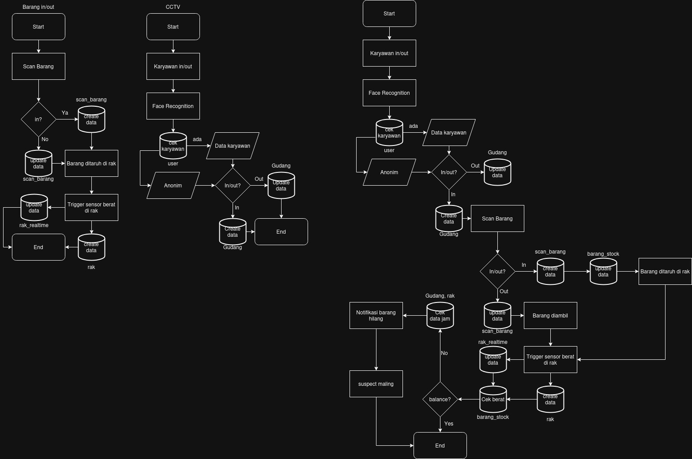

# SENTRY: Smart Warehouse Monitoring System

This project is designed to monitor employee and item movement within a warehouse using **face recognition** and **weight sensors**. It aims to improve security, ensure accurate inventory records, and detect potential theft or data inconsistencies.

## Key Features
- Automatic employee detection using face recognition
- Monitoring item check-in and check-out
- Weight tracking via shelf-mounted sensors
- Notifications for missing items or suspicious activity

## Team Members
- **[@taufanAli65](https://github.com/taufanAli65)** – Team Leader, Backend Developer, Mobile Developer  
- **[@abdisetiakawan](https://github.com/abdisetiakawan)** – Backend Developer, Web Frontend Developer  
- **[@DwiJullian](https://github.com/DwiJullian)** – Machine Learning Engineer  
- **[@RahadianCondro](https://github.com/RahadianCondro)** – IoT Engineer  
- **[@sazaghi](https://github.com/sazaghi)** – Web Frontend Developer, Mobile Developer  
- **[@astisulistio](https://github.com/astisulistio)** – UI/UX Developer

## Technologies Used
- Python / Node.js (Backend)
- Vue.js (Web Frontend)
- Flutter (Mobile Apps)
- MongoDB (Database)
- Etc.

## System Overview
Employees are recognized through a face recognition system when entering or exiting the warehouse. Items are scanned during both check-in and check-out, and shelf sensors track weight changes. The system compares scanned data with real-time sensor input to ensure consistency. If any mismatch is detected, the system sends a notification and logs the suspicious activity.

## System Flowchart

